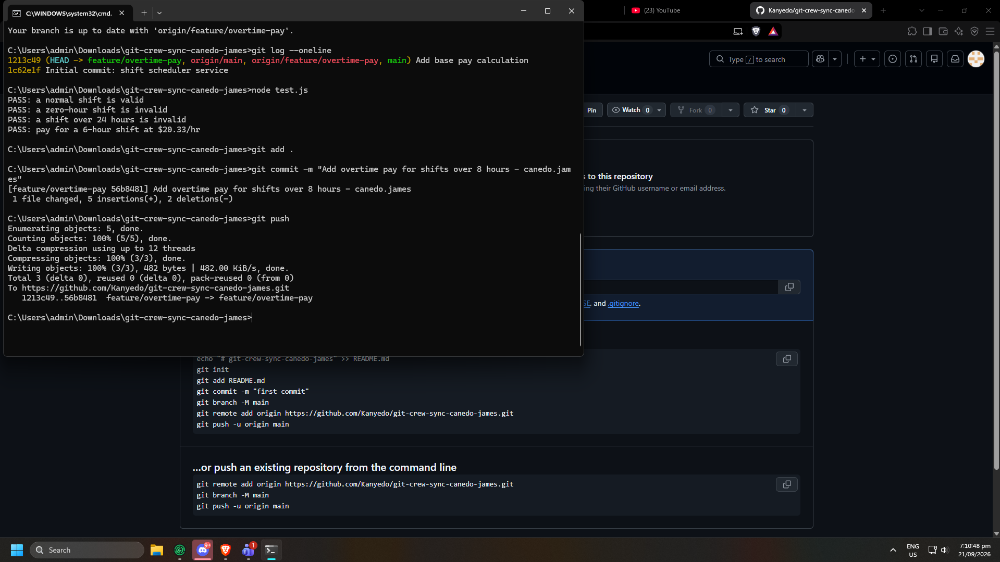
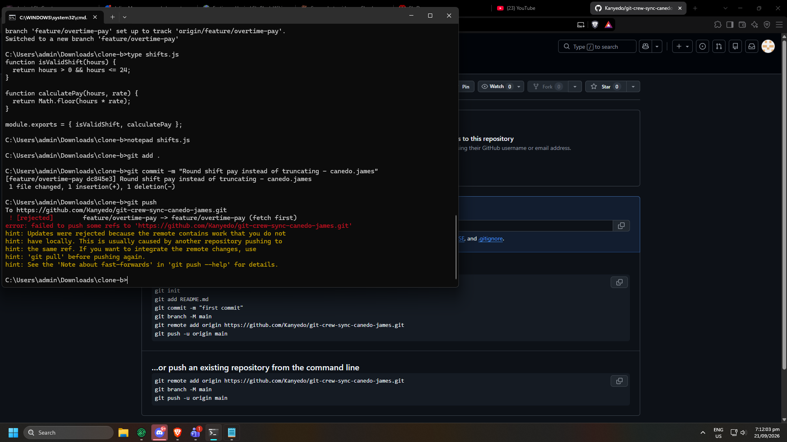
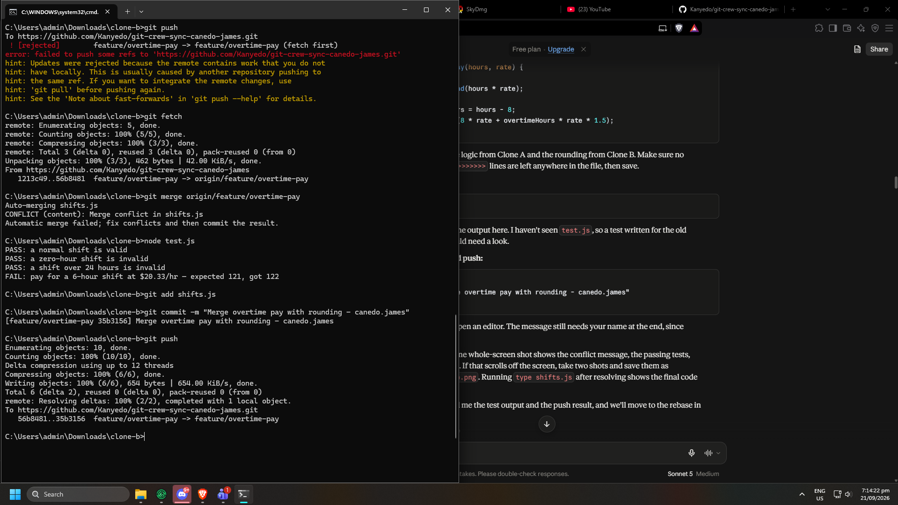
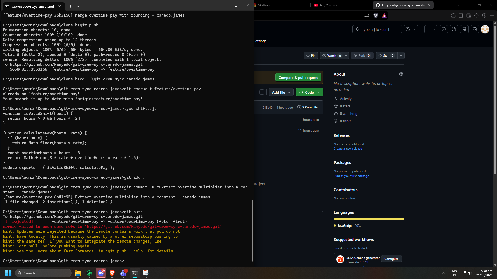
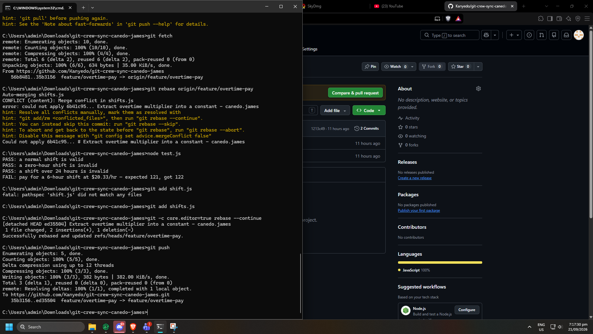
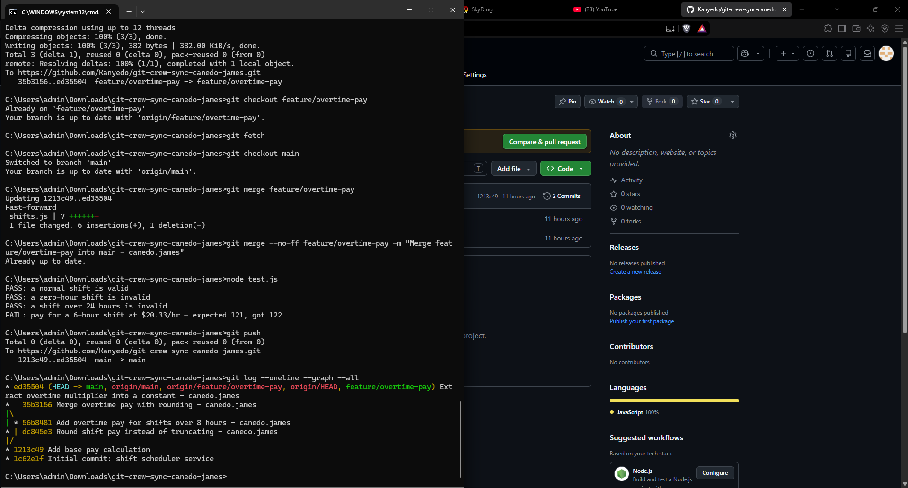
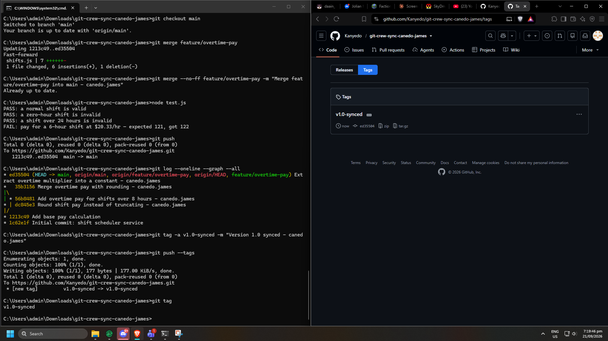

# WORKFLOW.md

Git Crew Sync lab - canedo.james

I acted as two developers (Clone A and Clone B) working on the same GitHub repo, `git-crew-sync-canedo-james`, and did the whole `feature/overtime-pay` workflow.

---

## Task 1: Push a change from Clone A

In Clone A I checked out `feature/overtime-pay` and added overtime pay to `calculatePay`. Shifts over 8 hours get time-and-a-half for the extra hours. I committed and pushed it.

**Task 1 evidence**

---

## Task 2: Diverge from Clone B and get rejected

Clone B had not fetched Clone A's push, so it still had the old `calculatePay`. I changed the same function to use `Math.round` instead of `Math.floor`, committed it, and tried to push. The push was rejected.

**Task 2 evidence**

---

## Task 3: Reconcile with a merge

In Clone B I ran `git fetch` and `git merge origin/feature/overtime-pay`. Git reported a conflict in `shifts.js` because both of us changed `calculatePay`. I fixed it by keeping the overtime logic from Clone A and the rounding from Clone B in the same function. Then I committed the merge ("Merge overtime pay with rounding") and pushed.

**Task 3 evidence**

---

## Task 4: Diverge again and reconcile with a rebase

In Clone A I moved the 1.5 overtime multiplier into a constant, without fetching first. I committed and tried to push, and got rejected again. This time I ran `git fetch` and `git rebase origin/feature/overtime-pay`. There was a conflict in `shifts.js` again. I fixed it so the function has the rounding and the constant, ran `git rebase --continue`, and pushed without force.

**Task 4 - rejected push**

**Task 4 - rebase conflict and resolution**

---

## Task 5: Merge into main

In Clone A I merged `feature/overtime-pay` into `main` and pushed `main`. After the merge, one test in `test.js` was still failing, because it expected the old truncated pay for a 6-hour shift at $20.33/hr (121) while the code now rounds (122). I updated the test in my last commit.

**Task 5 evidence**

---

## Task 6: Tag

I tagged the final commit `v1.0-synced` and pushed the tag with `git push --tags`.

**Task 6 evidence**

---

## Questions

**1. What did the rejected push error message tell you, and why did it happen?**

The error said the push was rejected because the remote has work that I don't have locally, and it told me to do a `git pull` first before pushing again. It happened because Clone A already pushed the overtime pay commit to `feature/overtime-pay`, but Clone B never fetched it. So Clone B was still on the old version of the branch when I made my rounding commit. Our two branches split apart, and if Git let me push, it would have wiped out Clone A's commit, so it blocked me.

**2. What's the actual difference between how you resolved Task 3 (merge) vs Task 4 (rebase)?**

In Task 3 I merged, so Git kept both histories and made a new merge commit to join them. I fixed the conflict once inside that merge commit, and the history graph shows the branch splitting and coming back together. In Task 4 I rebased, which basically took my commit and replayed it on top of what was already on the remote. The conflict showed up while it was replaying my commit, and after I fixed it and ran `git rebase --continue`, the history was one straight line with no merge commit. Since my branch then included everything from the remote, I could push without using force.

**3. What one habit would have avoided both rejected pushes in this lab?**

Running `git fetch` (or `git pull`) before I start working and again before I push. Both times the remote had new commits and my clone didn't know about them. If I had checked first, I would've seen it and dealt with it before making my own commit.

**4. Which approach - merge or rebase - would you default to on a shared team branch, and why?**

I'd default to merge on a shared branch. Rebase changes your commits (they get new hashes), and if other people already pulled the old ones it can mess up their copies and cause even more conflicts. Merge doesn't touch anyone's existing commits, so it's safer when a bunch of people are working on the same branch. The downside is the history gets a bit messy with all the merge commits. I'd still use rebase on my own commits that I haven't pushed yet, like in Task 4, because it keeps things cleaner.
